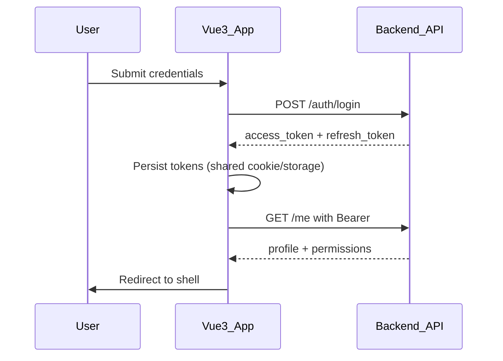
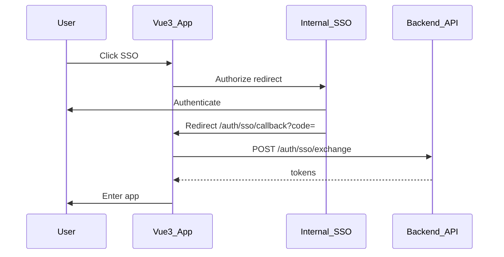
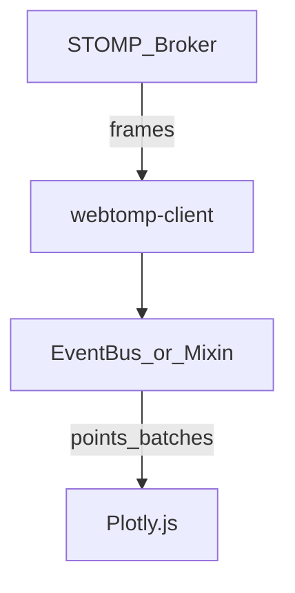
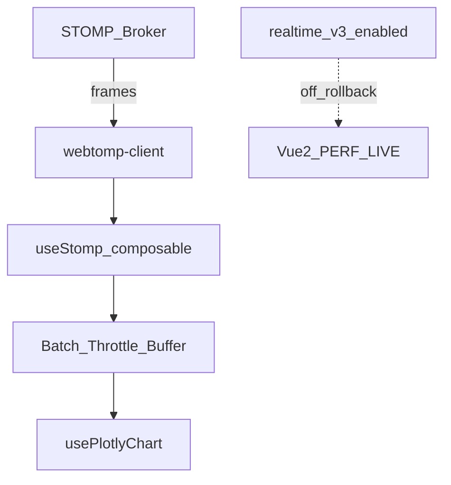

# Kế hoạch Chuyển đổi Vue 2 → Vue 3 (Greenfield + Opus-X) — Tài liệu tổng hợp

> File này gộp toàn bộ nội dung trong `docs/`.  
> Repo app: Vite + Vue 3 + Pinia + `uidev-component-vue3` (không dùng Tailwind).  
> Ngày tổng hợp: 2026-09-09

## Mục lục

1. [Executive Brief (BGH)](#1-executive-brief-bgh)
2. Audit
   - [2.1 Screen Inventory](#21-screen-inventory)
   - [2.2 Component Gap Analysis](#22-component-gap-analysis-opus-x)
   - [2.3 Legacy Patterns](#23-legacy-patterns-catalog)
   - [2.4 Auth JWT + SSO](#24-auth-jwt--sso)
   - [2.5 Performance Testing](#25-performance-testing-deep-dive)
   - [2.6 Dependency Decision Log](#26-dependency-decision-log)
   - [2.7 Risk Register](#27-risk-register)
   - [2.8 Definition of Done](#28-definition-of-done)
   - [2.9 Migration Backlog](#29-migration-backlog)
3. Preparation
   - [3.1 Rollback Playbook](#31-rollback-playbook)
   - [3.2 Proxy Routing](#32-proxy-routing)
   - [3.3 Coding Standards](#33-coding-standards)
4. Conversion
   - [4.1 Waves W1–W5](#41-conversion-waves-w1w5)
   - [4.2 Per-screen Checklist](#42-per-screen-checklist)
   - [4.3 Conversion Runbook](#43-conversion-runbook)
5. Testing & Go-Live
   - [5.1 Regression Matrix](#51-regression-matrix)
   - [5.2 Soak Test Plan](#52-soak-test-plan)
   - [5.3 UAT Script](#53-uat-script)
   - [5.4 Go-Live Runbook](#54-go-live-runbook)
   - [5.5 Decommission Plan](#55-vue-2-decommission-plan)
6. Governance
   - [6.1 Dual-Track](#61-dual-track-governance)
   - [6.2 Must-Port Board](#62-must-port-board)
   - [6.3 Weekly Sync](#63-weekly-migration-sync)

---


<!-- source: docs/executive/brief-bgh.md -->

## 1. Executive Brief (BGH)

**Audience:** Ban Giám đốc / Eng leadership  
**Recommendation:** **Approve** 7-month baseline (buffer to 8) greenfield migration with dual-track delivery and proxy rollback.  
**Owner:** Migration Lead (Senior Vue 3) + Eng Manager

---

### 1. Why now

- Vue 2 is **EOL** (no official security/maintenance patches since end of 2023). Remaining on Vue 2 is a **compliance and security exposure**, not a neutral delay.
- Vue-specific wrappers in the current stack (`vue-apexcharts`, `vue-grid-layout`, `vue-simple-*`, …) are increasingly unmaintained → rising cost of “temporary patches”.
- Hiring and onboarding favor Vue 3 / Composition API; Options + heavy mixins slow every feature.

### 2. What we will deliver

| Item | Detail |
|------|--------|
| Approach | **New Vue 3 app** (Vite), same UX via **UIdev Opus-X**, not risky in-place rewrite |
| Scope | ~50 screens / ~100 components |
| Core risk isolated | **Performance Testing** (WebSTOMP + Plotly) in dedicated wave + feature flag |
| Parallel delivery | Vue 2 features continue under **must-port governance** |
| Safety | Path-based proxy cutover; **rollback ≤ 15–30 minutes** to Vue 2 |

### 3. Business outcomes

- **Performance:** leaner runtime/bundles (Vite + Vue 3 reactivity) — material for realtime charts.
- **Maintainability:** Composition API / composables replace mixins & event bus → faster change, fewer regressions.
- **Design system:** single Opus-X source of truth → lower UI inconsistency cost.
- **TypeScript-ready platform:** safer expansion of the product.

### 4. Investment (people)

| Role | Allocation |
|------|------------|
| Senior Vue 3 (Lead) | 60–70% for 6–8 months |
| FE (1–2) | 40–70% alternating with Vue 2 features |
| DevOps / BE | 10–20% at milestones (SSO, proxy, flags) |
| QA | ramps from month 3 |

Rough engineering effort on screens alone ~100 person-days; with prep/spike/QA fits **Q-spanning 7 months** given dual-track load.

### 5. Timeline (baseline 7 months)

1. Audit (3 weeks)  
2. Preparation / skeleton (4–6 weeks) — **repo already bootstrapped**  
3. Conversion waves W1→W5 (~4 months)  
4. UAT / Go-Live / Vue2 standby 2–4 weeks  

Hard Go-Live targets end of month 7; month 8 is contingency for realtime soak slip.

### 6. Risk control (what BGH should hear)

| Risk | Control |
|------|---------|
| Big-bang outage | Module cutover + independent Perf flag |
| Realtime regression | Early spike, soak 2–4h, dedicated rollback |
| Feature drift | Must-port board + module freeze |
| Single senior bottleneck | Templates, PR checklist, pairing |

### 7. Ask of BGH

1. Approve dual-track policy (features on Vue 2 + migration capacity protected).  
2. Approve 7–8 month window and Lead allocation.  
3. Endorse rollback SLO and standby Vue 2 until decommission gates pass.  
4. Support UIdev escalation for Opus-X gaps without waiting for end of project.

### 8. Cost of “do nothing”

Continued Vue 2 = accumulating security debt, slower features, harder hiring, and a **larger, riskier** future migration under incident pressure rather than a controlled program.

---

**Decision requested:** Go / Go-with-changes / No-Go  
**Sponsor signature:** __________________ Date: __________

---


<!-- source: docs/audit/screen-inventory.md -->

## 2.1 Screen Inventory

> Phase Audit deliverable. Owner/traffic estimates are placeholders for kickoff refinement. Wave mapping drives Conversion order.

| # | Screen ID | Name | Module | Traffic | Realtime | Key libs | Wave | Effort (d) | Owner |
|---|-----------|------|--------|---------|----------|----------|------|------------|-------|
| 1 | AUTH-LOGIN | Login | Auth | High | No | axios | W1 | 2 | Senior |
| 2 | AUTH-SSO | SSO Callback | Auth | High | No | axios | W1 | 2 | Senior |
| 3 | AUTH-LOGOUT | Logout | Auth | Med | No | — | W1 | 0.5 | Senior |
| 4 | SHELL-LAYOUT | App Shell / Nav | Shell | High | No | uidev | W1 | 3 | Senior |
| 5 | SHELL-403 | Forbidden | Shell | Low | No | — | W1 | 0.5 | FE |
| 6 | SHELL-404 | Not Found | Shell | Low | No | — | W1 | 0.5 | FE |
| 7 | HOME-DASH | Home Dashboard | Core | High | No | apexcharts | W2 | 3 | FE |
| 8 | SETTINGS-GEN | General Settings | Settings | Med | No | — | W2 | 2 | FE |
| 9 | SETTINGS-I18N | Language / Locale | Settings | Low | No | vue-i18n | W2 | 1 | FE |
| 10 | SETTINGS-PROF | User Profile | Settings | Med | No | — | W2 | 2 | FE |
| 11 | CAT-LIST | Catalog List | Catalog | Med | No | — | W2 | 2 | FE |
| 12 | CAT-DETAIL | Catalog Detail | Catalog | Med | No | markdown-it | W2 | 2 | FE |
| 13 | CAT-FORM | Catalog Form | Catalog | Med | No | — | W2 | 2 | FE |
| 14 | SQL-VIEWER | SQL Viewer | Tools | Med | No | sql-formatter | W2 | 2 | FE |
| 15 | MD-VIEWER | Markdown Viewer | Tools | Low | No | markdown-it, sanitize-html | W2 | 2 | FE |
| 16 | XML-VIEWER | XML Viewer | Tools | Low | No | xml-reader | W2 | 1.5 | FE |
| 17 | NOTIF-LIST | Notifications | Core | Med | No | — | W2 | 1.5 | FE |
| 18 | AUDIT-LOG | Audit Log | Admin | Low | No | — | W2 | 2 | FE |
| 19 | USER-LIST | User List | Admin | Med | No | — | W2 | 2 | FE |
| 20 | USER-FORM | User Form | Admin | Med | No | — | W2 | 2 | FE |
| 21 | ROLE-LIST | Roles & Permissions | Admin | Med | No | — | W2 | 2 | FE |
| 22 | HELP-CENTER | Help Center | Content | Low | No | markdown-it | W2 | 1.5 | FE |
| 23 | CAL-MONTH | Calendar Month | Schedule | Med | No | @fullcalendar | W3 | 3 | FE |
| 24 | CAL-EVENT | Calendar Event Form | Schedule | Med | No | @fullcalendar | W3 | 2 | FE |
| 25 | UPLOAD-MGR | Upload Manager | Files | Med | No | vue-simple-uploader→Opus | W3 | 3 | FE |
| 26 | FILE-BROWSER | File Browser | Files | Med | No | — | W3 | 2 | FE |
| 27 | SUGGEST-SEARCH | Global Suggest Search | Search | High | No | vue-simple-suggest→Opus | W3 | 2 | FE |
| 28 | EXPORT-XLSX | Export Excel | Export | Med | No | xlsx | W3 | 1.5 | FE |
| 29 | EXPORT-PDF | Export PDF | Export | Med | No | pdfmake | W3 | 2 | FE |
| 30 | EXPORT-DOCX | Export DOCX | Export | Low | No | html-to-docx | W3 | 2 | FE |
| 31 | CHART-APEX | Apex Analytics | Analytics | Med | No | apexcharts | W3 | 2.5 | FE |
| 32 | GRID-DASH | Draggable Grid Dash | Analytics | Low | No | vue-grid-layout→Opus | W3 | 3 | FE |
| 33 | MATH-DOC | Math Document | Content | Low | No | vue-mathjax→MathJax3 | W3 | 2 | FE |
| 34 | SSE-FEED | SSE Live Feed | Live | Low | SSE | fetch-event-source | W3 | 2 | FE |
| 35 | TOOLTIP-DEMO | Contextual Help Overlays | UX | Low | No | vue-directive-tooltip→Opus | W3 | 1 | FE |
| 36 | PERF-LIST | Performance Test Runs | Perf | High | No | — | W4 | 3 | Senior |
| 37 | PERF-DETAIL | Performance Run Detail | Perf | High | No | plotly | W4 | 3 | Senior |
| 38 | PERF-LIVE | **Performance Testing (Live)** | Perf | **Critical** | **STOMP** | webtomp-client, plotly | W4 | 8 | Senior |
| 39 | PERF-COMPARE | Run Comparison | Perf | Med | No | plotly | W4 | 3 | Senior |
| 40 | PERF-REPORT | Performance Report | Perf | Med | No | pdfmake, xlsx | W4 | 2 | FE |
| 41 | REPORT-BUILDER | Report Builder | Reports | Med | No | — | W5 | 3 | FE |
| 42 | REPORT-SCHED | Scheduled Reports | Reports | Low | No | moment-timezone | W5 | 2 | FE |
| 43 | INTEG-LIST | Integrations | Admin | Low | No | sshpk | W5 | 2 | FE |
| 44 | INTEG-FORM | Integration Form | Admin | Low | No | sshpk | W5 | 2 | FE |
| 45 | ALERT-RULES | Alert Rules | Ops | Med | No | — | W5 | 2 | FE |
| 46 | ALERT-HISTORY | Alert History | Ops | Med | No | — | W5 | 1.5 | FE |
| 47 | TEAM-LIST | Teams | Admin | Low | No | — | W5 | 1.5 | FE |
| 48 | TEAM-DETAIL | Team Detail | Admin | Low | No | — | W5 | 1.5 | FE |
| 49 | ABOUT | About / Version | Shell | Low | No | — | W5 | 0.5 | FE |
| 50 | FEATURE-FLAGS | Feature Flags Admin | Admin | Low | No | — | W5 | 2 | FE |

### Summary by wave

| Wave | Screens | Est. days | Focus |
|------|---------|-----------|-------|
| W1 | 6 | ~8.5 | Auth, shell, guards |
| W2 | 16 | ~31 | Low-risk CRUD / viewers |
| W3 | 13 | ~28 | Vue2 wrappers → Opus-X |
| W4 | 5 | ~19 | Core realtime Performance Testing |
| W5 | 10 | ~18 | Remainder + drift cleanup |
| **Total** | **50** | **~104.5** | ≈ 5–6 FE-months wall-clock with parallelization |

### DoD (per screen)

See [definition-of-done.md](./definition-of-done.md).

---


<!-- source: docs/audit/component-gap-opus-x.md -->

## 2.2 Component Gap Analysis (Opus-X)

> Map ~100 legacy components to Opus-X equivalents. Gaps escalate to UIdev team immediately.

### Status legend

- **Ready** — exists in uidev-component Vue 3 (Opus-X)
- **Partial** — exists but props/slots differ; needs adapter
- **Gap** — must build local wrapper or request UIdev
- **Replace** — drop Vue2 lib; use Opus-X or thin Composition wrapper

### Foundation / layout (12)

| Legacy | Opus-X target | Status | Notes |
|--------|---------------|--------|-------|
| AppHeader | OxHeader | Ready | |
| AppSidebar | OxSidebar / OxNav | Ready | |
| AppFooter | OxFooter | Ready | |
| PageContainer | OxPage | Ready | |
| CardPanel | OxSection (not card-heavy) | Partial | Prefer section layout |
| ModalDialog | OxModal | Ready | |
| DrawerPanel | OxDrawer | Ready | |
| TabsBar | OxTabs | Ready | |
| Breadcrumb | OxBreadcrumb | Ready | |
| EmptyState | OxEmpty | Ready | |
| LoadingOverlay | OxSpinner / OxSkeleton | Ready | |
| SplitPane | OxSplit | Partial / Gap | Confirm Opus-X |

### Form controls (18)

| Legacy | Opus-X target | Status | Notes |
|--------|---------------|--------|-------|
| BaseInput | OxInput | Ready | |
| BaseTextarea | OxTextarea | Ready | |
| BaseSelect | OxSelect | Ready | |
| BaseCheckbox | OxCheckbox | Ready | |
| BaseRadio | OxRadio | Ready | |
| BaseSwitch | OxSwitch | Ready | |
| BaseDatePicker | OxDatePicker | Ready | moment→keep temporarily |
| BaseTimePicker | OxTimePicker | Ready | |
| BaseFileInput | OxUpload | Ready | replaces vue-simple-uploader |
| FormField | OxField | Ready | |
| FormError | OxFieldError | Ready | |
| SearchBox | OxSearch | Ready | |
| SuggestInput | OxAutocomplete | Ready | replaces vue-simple-suggest |
| TagInput | OxTagInput | Partial | |
| NumberInput | OxNumberInput | Ready | |
| PasswordInput | OxPassword | Ready | |
| ColorPicker | OxColorPicker | Gap | Low priority W5 |
| RichTextLite | OxTextarea + markdown | Partial | |

### Data display (16)

| Legacy | Opus-X target | Status | Notes |
|--------|---------------|--------|-------|
| DataTable | OxTable | Ready | |
| Pagination | OxPagination | Ready | |
| Badge | OxBadge | Ready | |
| StatusDot | OxStatus | Ready | |
| Tooltip | OxTooltip | Ready | replaces vue-directive-tooltip |
| Popover | OxPopover | Ready | |
| Avatar | OxAvatar | Ready | |
| KeyValueList | OxDescriptionList | Ready | |
| CodeBlock | OxCode | Partial | |
| MarkdownView | local + sanitize-html | Replace | Keep markdown-it |
| SqlView | local + sql-formatter | Replace | |
| XmlView | local + xml-reader | Replace | |
| MathBlock | MathJax3 wrapper | Replace | drop vue-mathjax |
| TreeView | OxTree | Partial | |
| Timeline | OxTimeline | Gap | |
| StatMetric | OxMetric | Partial | Avoid card clutter |

### Charts / realtime (10)

| Legacy | Opus-X target | Status | Notes |
|--------|---------------|--------|-------|
| VueApexChart | ApexChart.vue wrapper | Replace | apexcharts core |
| PlotlyStatic | PlotlyChart.vue | Replace | |
| PlotlyRealtime | PlotlyRealtimeChart.vue | Replace | W4 critical |
| ChartLegend | local | Gap | |
| ChartToolbar | OxToolbar | Partial | |
| StompStatusBadge | OxStatus | Ready | |
| LiveIndicator | OxStatus pulse | Partial | |
| PerfMetricStrip | OxMetric row | Partial | |
| CompareChart | PlotlyChart | Replace | |
| MiniSparkline | ApexChart mini | Replace | |

### Files / calendar / grid (12)

| Legacy | Opus-X target | Status | Notes |
|--------|---------------|--------|-------|
| Uploader | OxUpload | Ready | |
| UploadQueue | OxUploadQueue | Partial / Gap | |
| FileIcon | OxFileIcon | Ready | |
| FileList | OxTable / OxList | Ready | |
| FullCalendarView | @fullcalendar/vue3 | Replace | |
| EventChip | OxBadge | Ready | |
| GridLayout | OxGrid / CSS grid | Replace | drop vue-grid-layout |
| GridItem | OxGridItem | Gap | |
| DragHandle | OxDragHandle | Gap | |
| DropZone | OxUpload dropzone | Ready | |
| ProgressBar | OxProgress | Ready | |
| ConfirmDelete | OxModal | Ready | |

### Auth / feedback / misc (remaining → ~100)

| Legacy | Opus-X target | Status | Notes |
|--------|---------------|--------|-------|
| LoginForm | OxForm + fields | Ready | |
| SsoButton | OxButton | Ready | |
| PermissionGate | composable + slot | Replace | |
| ToastHost | OxToast | Ready | |
| AlertBanner | OxAlert | Ready | |
| ErrorBoundary | local | Gap | |
| I18nToggle | OxSelect | Ready | |
| Theme tokens | Opus-X CSS vars | Ready | |
| Icon set | OxIcon | Ready | |
| … | … | … | Fill remaining during Audit week 2 |

### Escalations to UIdev (priority)

1. Upload queue with multi-file progress parity
2. Draggable dashboard grid (if not in Opus-X)
3. Split pane for Performance Testing layout
4. Timeline for alert history

### Sign-off

| Role | Name | Date | Signature |
|------|------|------|-----------|
| FE Lead (Vue 3) | | | |
| Design (Opus-X) | | | |
| UIdev owner | | | |

---


<!-- source: docs/audit/legacy-patterns-catalog.md -->

## 2.3 Legacy Patterns Catalog

> Hotspots that block mechanical porting. Counts are kickoff estimates — update with `rg` on the Vue 2 repo in Audit week 1.

### Summary

| Pattern | Est. occurrences | Severity | Target pattern |
|---------|------------------|----------|----------------|
| Options API SFCs | ~100 components | Med | Composition API + `<script setup>` |
| Mixins | ~25–40 | **High** | Composables (`useX`) |
| Filters (`\| filter`) | ~60–100 | High | utils / computed |
| Event bus `$on/$off/$once` | ~30–50 | **High** | mitt (scoped) or Pinia |
| `Vue.prototype.*` | ~10–15 | High | `app.config.globalProperties` sparingly / provide |
| `Vue.set` / `Vue.delete` | ~20 | Med | Direct reactive assignment |
| `$listeners` / `$scopedSlots` | ~15 | Med | `v-bind="$attrs"` / named slots |
| Filters in templates for i18n/date | common | Med | `vue-i18n` / format utils |
| Global `Vue.use` plugins | ~8–12 | Med | `app.use` |
| Sync modifiers / `.native` | few | Low | Update listeners |

### Mixin → composable map (priority)

| Mixin (legacy) | Composable | Phase |
|----------------|------------|-------|
| authMixin | `useAuth` | W1 |
| permissionMixin | `usePermission` | W1 |
| i18nHelperMixin | `useI18n` (vue-i18n) | W1 |
| stompMixin | `useStomp` | W4 (spike early) |
| chartMixin | `usePlotlyChart` / `useApexChart` | W3–W4 |
| loadingMixin | `useAsyncState` | W2 |
| paginationMixin | `usePagination` | W2 |
| formDirtyMixin | `useFormDirty` | W2 |
| busMixin | remove — use explicit events | All |

### Event bus inventory (policy)

**Forbidden in Vue 3 app:** new global event bus for feature communication.

Allowed:
- `mitt` emitter **scoped to a feature module** (e.g. performance testing panel)
- Pinia store actions/subscriptions for cross-route state
- `provide` / `inject` within layout trees

### Filters to utilities

| Filter | Utility |
|--------|---------|
| `date` / `datetime` | `formatDate` (moment temporary → dayjs backlog) |
| `capitalize` | `capitalize` in `utils/string.ts` |
| `truncate` | `truncate` |
| `fileSize` | `formatBytes` |
| `number` | `formatNumber` / `Intl` |

### Audit commands (run on Vue 2 repo)

```bash
rg -n "mixins:\s*\[" --type vue -c
rg -n "\|\s*\w+" --type vue -c   # filters (noisy — review manually)
rg -n "\$on\(|\$off\(|\$once\(" -c
rg -n "Vue\.set|Vue\.delete|Vue\.prototype" -c
rg -n "eventBus|EventBus|\$bus" -c
```

### Refactor rules for Conversion

1. Do **not** copy Options API SFC verbatim if it pulls mixins/filters/bus.
2. Extract shared logic to `src/composables/` before building the view.
3. One PR per screen (or tightly coupled pair); include pattern cleanup in same PR.

---


<!-- source: docs/audit/auth-sso-sequence.md -->

## 2.4 Auth JWT + SSO

> Goal: Vue 3 auth behaves identically for users so **rollback does not force mass re-login**.

### Components

| Piece | Vue 2 (legacy) | Vue 3 (target) |
|-------|----------------|----------------|
| Login form | Local JWT password grant | Same API contract |
| SSO | Internal IdP redirect | Same client_id / redirect URIs (+ v3 callback if needed) |
| Token storage | Prefer **same cookie name/domain/path** as Vue 2 | Mirror exactly |
| API auth | `Authorization: Bearer <access>` | Same axios interceptor |
| Refresh | Refresh token rotation endpoint | Same |
| Logout | Revoke + clear storage + IdP logout optional | Same |

### Sequence — Password JWT



### Sequence — SSO



### Token contract (must match Vue 2)

Document actual values from legacy during Audit:

| Key | Expected | Actual (fill) |
|-----|----------|---------------|
| Access cookie name | e.g. `access_token` | |
| Refresh cookie name | e.g. `refresh_token` | |
| Cookie Domain | e.g. `.company.local` | |
| Cookie Path | `/` | |
| Cookie Secure / SameSite | Secure; Lax or None | |
| LocalStorage keys (if any) | | |
| JWT claims used | `sub`, `roles`, `exp` | |
| Clock skew tolerance | 30–60s | |

### Router guards (Vue 3)

1. `requiresAuth` — no valid access → login (preserve `redirect` query).
2. `requiresPermission` — use `usePermission`.
3. SSO callback route **public**.
4. After login, honor `redirect` only if same-origin relative path.

### Rollback implications

- Shared cookie domain ⇒ switching proxy Vue3 ↔ Vue2 keeps session.
- If Vue 3 must use a new SSO redirect URI, register it **before** W1 cutover; keep Vue 2 URI active.
- Never encrypt tokens with app-specific keys that differ between apps.

### Test cases (Auth parity)

- [ ] Login password success/fail
- [ ] SSO success / deny / cancel
- [ ] Token refresh mid-session
- [ ] Expire access → silent refresh → retry API
- [ ] Logout clears both apps’ readable storage
- [ ] Deep-link `/perf/live` while logged out → login → return
- [ ] Rollback during session: user still authenticated on Vue 2

---


<!-- source: docs/audit/performance-testing-deep-dive.md -->

## 2.5 Performance Testing Deep-Dive

> Highest technical risk. Spike `useStomp` + Plotly strategy **early (parallel to W2)** after W1 shell is up.

### Current architecture (Vue 2)



### Target architecture (Vue 3)



### Contract to preserve (do not change BE unless required)

| Item | Spec (fill in Audit) | Notes |
|------|----------------------|-------|
| Broker URL | `wss://…` | From env |
| STOMP host/vhost | | |
| Auth header / login | JWT? | Same as Vue 2 |
| Subscribe destinations | e.g. `/topic/perf.{runId}` | |
| Message payload schema | JSON points | Version field? |
| Heartbeat | outgoing/incoming ms | |
| Reconnect policy | exponential backoff | Mirror legacy |
| Avg message rate | msg/s | Benchmark target |
| Peak message rate | msg/s | |
| Points per message | | |

### Plotly update strategy (decision)

Evaluate on staging with production-like stream:

| Strategy | Pros | Cons | Verdict gate |
|----------|------|------|--------------|
| `Plotly.newPlot` each time | Simple | Too slow | Reject if >5Hz |
| `Plotly.react` | Full layout sync | Medium cost | OK mid frequency |
| `Plotly.restyle` / `extendTraces` | Fast append | Harder multi-trace | **Preferred for live** |

**Decision rule:** Choose the cheapest API that keeps UI ≤ 100ms frame budget at peak rate. Document chosen API in spike report.

### Backpressure

1. Batch window 50–100ms OR max N points.
2. Drop/coalesce intermediate points if buffer > high-water (document UX).
3. Pause subscription when tab `document.hidden` (optional; confirm product).
4. Cap visible points (sliding window) to control memory.

### Soak test requirements

| Metric | SLO (proposed) |
|--------|----------------|
| Tab open duration | 2–4 hours |
| Memory growth | < 20% after first 15 min steady state |
| WS disconnect recovery | < 5s reconnect success ≥ 99% |
| Chart freeze (>1s no paint under load) | 0 in soak |
| CPU (main thread avg) | Document baseline vs Vue 2 |

### Feature flag

- Name: `realtime_v3_enabled`
- Default off until W4 soak green
- Proxy can also route `/perf/live` → Vue 2 independently

### Spike checklist (Senior, ~3–5 days, after W1)

- [ ] Connect webtomp-client from Vite app
- [ ] Auth to broker parity
- [ ] Subscribe + parse payload
- [ ] Benchmark Plotly strategies
- [ ] Memory profile
- [ ] Write `useStomp` + `usePlotlyChart`
- [ ] Spike report signed → start W4 implementation

---


<!-- source: docs/audit/dependency-decision-log.md -->

## 2.6 Dependency Decision Log

> Signed decisions for Vue 3 greenfield. Update only via Lead change-control.

| Package (Vue 2) | Decision | Vue 3 approach | Risk | Owner | Status |
|-----------------|----------|----------------|------|-------|--------|
| vue | Replace | vue@3 | — | Lead | Approved |
| vuex | Replace | **pinia** | Med | Lead | Approved |
| vue-router | Replace | vue-router@4 | Low | Lead | Approved |
| vue-i18n | Upgrade | vue-i18n@9 | Med | Lead | Approved |
| uidev-component | Upgrade | **`uidev-component-vue3` (Opus-X) only** | Low | Lead | Approved |
| axios | Keep | axios | Low | FE | Approved |
| lodash | Keep→optimize | lodash-es per-function **when needed** (not in skeleton) | Low | FE | Deferred |
| mitt (new) | Add when needed | scoped events only | Low | Lead | Deferred |
| tailwindcss | **Do not use** | Styling via uidev-component-vue3 tokens/CSS | — | Lead | Approved |
| moment / moment-timezone | Keep temporary | backlog → dayjs/date-fns-tz post Go-Live | Med | FE | Approved |
| @fullcalendar | Upgrade | @fullcalendar/vue3 | Med | FE | Approved |
| vue-apexcharts | **Drop** | apexcharts + `ApexChart.vue` | Med | FE | Approved |
| plotly.js / plotly.js-dist-min | Keep | plotly.js + wrappers | Med | Senior | Approved |
| webtomp-client | Keep | + `useStomp` | **High** | Senior | Approved |
| @microsoft/fetch-event-source | Keep | same | Low | FE | Approved |
| vue-directive-tooltip | **Drop** | OxTooltip | Low | FE | Approved |
| vue-grid-layout | **Drop** | OxGrid / CSS grid | Med | FE | Approved |
| vue-simple-suggest | **Drop** | OxAutocomplete | Low | FE | Approved |
| vue-simple-uploader | **Drop** | OxUpload + axios | Med | FE | Approved |
| vue-mathjax | **Drop** | MathJax 3 component | Med | FE | Approved |
| markdown-it | Keep | + sanitize-html | Low | FE | Approved |
| sanitize-html | Keep | same | Low | FE | Approved |
| sql-formatter | Keep | same | Low | FE | Approved |
| pdfmake | Keep | same | Low | FE | Approved |
| html-to-docx | Keep | same | Low | FE | Approved |
| xlsx | Keep | same | Low | FE | Approved |
| xml-reader | Keep | same | Low | FE | Approved |
| sshpk | Keep | same | Low | FE | Approved |
| jest | Replace | **vitest** + @vue/test-utils | Med | FE | Approved |

### Explicit non-goals

- No Element Plus / Vuetify / Ant Design Vue.
- **No Tailwind** (or other utility CSS frameworks) — Opus-X via `uidev-component-vue3` only.
- No Vuex 4 “temporary forever”.
- No new global event bus.

### Sign-off

| Role | Date | Sign |
|------|------|------|
| Migration Lead (Senior Vue 3) | | |
| Eng Manager | | |

---


<!-- source: docs/audit/risk-register.md -->

## 2.7 Risk Register

| ID | Risk | Likelihood | Impact | Score | Mitigation | Owner | Status |
|----|------|------------|--------|-------|------------|-------|--------|
| R1 | Vue 2 EOL — no security patches if stay | High | High | Crit | Migrate to Vue 3 in 6–8 months | EM | Open |
| R2 | webtomp + Plotly realtime perf/memory | Med | High | High | Early spike; extendTraces; soak 2–4h; flag rollback | Senior | Open |
| R3 | Opus-X component gaps vs legacy UI | Med | Med | Med | Gap analysis week 1–2; escalate UIdev | Lead+Design | Open |
| R4 | Feature drift Vue2 ↔ Vue3 dual-track | High | High | Crit | Must-port board; module freeze after cutover | PM+Lead | Open |
| R5 | Single Senior bottleneck | High | Med | High | Templates, PR checklist, pair 2×/week | EM | Open |
| R6 | Auth/SSO cookie mismatch breaks rollback | Med | High | High | Shared token contract; parity tests | Senior | Open |
| R7 | Vue2 wrappers unmaintained | High | Med | High | Replace per decision log | FE | Open |
| R8 | Mixins/filters/bus rewrite overrun | Med | Med | Med | Catalog + composable map; DoD | Lead | Open |
| R9 | Proxy misroute during partial cutover | Low | High | Med | Route groups; dry-run rollback | DevOps | Open |
| R10 | moment tech debt deferred | Low | Low | Low | Post Go-Live backlog | FE | Accepted |

### Scoring

Score = Likelihood × Impact (qualitative). Crit/High require weekly review in migration sync.

---


<!-- source: docs/audit/definition-of-done.md -->

## 2.8 Definition of Done

A screen is **Done** only when all boxes pass.

### Functional

- [ ] Visual parity with Opus-X design (not pixel-legacy if Opus-X differs by standard)
- [ ] API parity with Vue 2 for same user journeys
- [ ] Auth/permission gates equivalent
- [ ] i18n keys present (vi + en minimum)
- [ ] Error / empty / loading states handled via Opus-X

### Technical

- [ ] Composition API + `<script setup>` (no new mixins/filters/bus)
- [ ] Shared logic in composables/Pinia as appropriate
- [ ] No forbidden legacy packages (see dependency-decision-log)
- [ ] Lint + unit/smoke tests green in CI
- [ ] Bundle impact reviewed if adding heavy lib (plotly, pdfmake, …)

### Quality

- [ ] QA checklist signed (desktop + mobile breakpoint)
- [ ] Basic a11y: focus order, labels, contrast on critical controls
- [ ] Security: user HTML sanitized (markdown paths)

### Release

- [ ] Proxy route toggled on staging
- [ ] Error budget watch 3–5 days (or agreed soak) before next wave dependency
- [ ] Must-port tickets for dual-track features closed or dated

---


<!-- source: docs/audit/migration-backlog.md -->

## 2.9 Migration Backlog

Priority = business criticality × technical risk. Execute top-down; do not reorder W4 behind convenience ports.

### Epic order

1. **E0 Audit closeout** — inventory signed, gaps escalated, risk register live
2. **E1 Preparation** — Vite skeleton, Opus-X, auth, proxy, rollback dry-run, vertical slice
3. **E2 W1** — Auth JWT/SSO + Shell + guards + i18n
4. **E3 Spike realtime** — useStomp + Plotly benchmark (parallel with early W2)
5. **E4 W2** — Low-risk screens (settings, catalog, viewers, admin CRUD)
6. **E5 W3** — Medium libs (calendar, upload, export, apex, grid)
7. **E6 W4** — Performance Testing suite (list/detail/live/compare/report)
8. **E7 W5** — Remainder + drift burn-down
9. **E8 Testing & Go-Live** — regression, UAT, cutover, standby, decommission plan

### Ordered backlog items

| Rank | ID | Item | Wave | Est (d) | Depends |
|------|----|------|------|---------|---------|
| 1 | AUD-01 | Finalize screen inventory owners/traffic | Audit | 2 | — |
| 2 | AUD-02 | Opus-X gap sign-off + UIdev escalate | Audit | 3 | AUD-01 |
| 3 | AUD-03 | Legacy pattern counts from Vue2 repo | Audit | 2 | — |
| 4 | AUD-04 | Auth cookie/SSO contract measured | Audit | 2 | — |
| 5 | AUD-05 | Perf STOMP contract documented | Audit | 2 | — |
| 6 | PREP-01 | Repo Vite + uidev-component-vue3 (Opus-X) | Prep | 2 | — |
| 7 | PREP-02 | Pinia, router, i18n, axios | Prep | 2 | PREP-01 |
| 8 | PREP-03 | useAuth / usePermission / SSO routes | Prep | 3 | PREP-02, AUD-04 |
| 9 | PREP-04 | Proxy staging + rollback playbook dry-run | Prep | 2 | DevOps |
| 10 | PREP-05 | Vertical slice CRUD on staging | Prep | 3 | PREP-03 |
| 11 | W1-01 | Shell layout Opus-X | W1 | 3 | PREP-05 |
| 12 | W1-02 | Login + SSO callback parity | W1 | 4 | PREP-03 |
| 13 | W1-03 | Route guards + 403/404 | W1 | 1.5 | W1-01 |
| 14 | SPK-01 | Realtime Plotly spike report | Spike | 5 | W1-01 |
| 15 | W2-* | Screens #7–22 per inventory | W2 | 31 | W1 |
| 16 | W3-* | Screens #23–35 | W3 | 28 | W2 foundation |
| 17 | W4-* | Screens #36–40 (PERF-LIVE critical) | W4 | 19 | SPK-01 |
| 18 | W5-* | Screens #41–50 + drift | W5 | 18 | W3/W4 |
| 19 | QA-01 | Full regression matrix | Test | 5 | W5 |
| 20 | REL-01 | Go-Live + Vue2 standby 2–4 weeks | Test | 5 | QA-01 |

### Capacity note

~104 screen-days + prep/audit/spike/QA ≈ fits **7-month baseline** with 1 Senior (60–70%) + 1–2 FE (50–70%) and dual-track Vue2 load — buffer to month 8 for realtime slip.

---


<!-- source: docs/preparation/rollback-playbook.md -->

## 3.1 Rollback Playbook

**Principle:** Rollback = **traffic switch to Vue 2**, not git revert on live users.

### SLO

| Metric | Target |
|--------|--------|
| Decision → Vue2 traffic restored | **≤ 15–30 minutes** |
| User re-login required | **No** (shared JWT/SSO cookie contract) |
| Data loss | **None** (server-authoritative state) |

### Preconditions

- [ ] Vue 2 production still deployed (hot standby until decommission)
- [ ] Proxy supports per-route-group upstream (Auth, Catalog, Perf, …)
- [ ] Feature flag `realtime_v3_enabled` controllable without redeploy
- [ ] On-call knows proxy console / config repo
- [ ] Dry-run completed on staging this milestone

### Trigger criteria (any one)

1. FE/API error rate ≥ **2× baseline** for 15 minutes on migrated routes
2. SSO login success rate drops below agreed SLO
3. Performance Live: disconnect rate or chart freeze breaches soak SLO
4. Sev-1 business defect attributable to Vue 3 UI
5. Executive decision / security incident

### Procedure

1. **Declare** rollback in war-room channel; assign Incident Commander.
2. **Disable** feature flags for affected modules (`realtime_v3_enabled`, module flags).
3. **Point proxy** for affected path groups to Vue 2 upstream.
4. **Verify** health: login, 2–3 critical journeys, Perf Live if in scope.
5. **Communicate** status to stakeholders; open hotfix tickets on Vue 3.
6. **Post-incident**: timeline, root cause, re-cutover criteria.

### Proxy toggle examples

See [proxy-routing.md](./proxy-routing.md). Prefer config flags over rewriting app code.

### Dry-run checklist

- [ ] Staging mirror of prod routing
- [ ] Switch Catalog → Vue2 and back < 15 min
- [ ] Switch Perf Live independently
- [ ] Confirm session cookie still valid on Vue2
- [ ] Document exact commands / MR template for prod

### After Go-Live

Keep Vue 2 standby **2–4 weeks**. Decommission only when metrics stable, no rollback, drift backlog = 0 (see testing/decommission-plan.md).

---


<!-- source: docs/preparation/proxy-routing.md -->

## 3.2 Proxy Routing

### Target topology

```
users → gateway/proxy → vue3 (migrated routes)
                      → vue2 (legacy / rollback)
```

### Suggested path groups

| Group | Paths (example) | Default after W1 | Rollback target |
|-------|-----------------|------------------|-----------------|
| Auth | `/login`, `/auth/*` | Can stay Vue3 early | Vue2 |
| Shell assets | `/app-v3/*` or `v3.` host | Vue3 | Vue2 |
| Catalog | `/catalog*` | Vue3 after W2 | Vue2 |
| Perf Live | `/perf/live` | Vue3 only if flag on | Vue2 **independent** |
| Default | `/*` | Vue2 until Go-Live | — |

### Nginx sketch

```nginx
## deploy/nginx-proxy.conf.example
upstream vue2_upstream { server vue2:80; }
upstream vue3_upstream { server vue3:80; }

map $cookie_v3_override $vue3_force {
  default 0;
  "1" 1;
}

server {
  listen 443 ssl;
  server_name app.example.internal;

  # Module cutover flags (ops-controlled)
  set $catalog_v3 1;
  set $perf_v3 0;

  location /catalog {
    if ($catalog_v3 = 0) { proxy_pass http://vue2_upstream; }
    proxy_pass http://vue3_upstream;
  }

  location /perf/live {
    if ($perf_v3 = 0) { proxy_pass http://vue2_upstream; }
    proxy_pass http://vue3_upstream;
  }

  location / {
    proxy_pass http://vue2_upstream;
  }
}
```

### Staging

- Subdomain `v3.` **or** prefix `/app-v3/` during Preparation.
- Same API host; CORS not required if same-site proxy.

### Ops runbook snippet

```bash
## Example: flip perf back to Vue2 via config repo + reload
## (replace with your real config mechanism)
./ops/set-flag.sh perf_v3 0 && ./ops/reload-proxy.sh
```

---


<!-- source: docs/preparation/coding-standards.md -->

## 3.3 Coding Standards

### Hard rules

1. **Composition API + `<script setup>`** for all new SFCs.
2. **No mixins.** Extract `useX` composables.
3. **No filters.** Use functions / computed.
4. **No global event bus.** Prefer Pinia, props/emits, provide/inject, or **scoped** `mitt`.
5. **UI only from `uidev-component-vue3` (Opus-X).** No Tailwind, Element Plus, Vuetify, or Ant Design Vue.
6. **Pinia** for shared state — do not add Vuex.
7. **i18n** every user-visible string (`vue-i18n` v9).

### PR checklist

- [ ] Screen DoD satisfied ([definition-of-done](../audit/definition-of-done.md))
- [ ] No new Vue2 wrapper libs
- [ ] Types for public composable APIs
- [ ] Unit/smoke test or explicit QA note
- [ ] Must-port ticket linked if dual-track feature
- [ ] Screenshot / Loom for UI-heavy changes

### File layout

```
src/
  api/           # HTTP modules
  composables/   # useAuth, useStomp, …
  stores/        # Pinia
  views/         # route-level pages
  layouts/
  utils/
packages/
  uidev-component-vue3/  # local stand-in → replace with registry package
```

### Realtime

- Batch/throttle before Plotly updates.
- Gate production traffic with `realtime_v3_enabled`.

---


<!-- source: docs/conversion/waves.md -->

## 4.1 Conversion Waves W1–W5

Track cutover status here. Update `Status` as screens ship.

Statuses: `todo` | `in_progress` | `staging` | `cutover` | `done`

### W1 — Auth / Shell (3–4 weeks)

| Screen | Status | PR | Notes |
|--------|--------|----|-------|
| AUTH-LOGIN | done (skeleton) | — | demo/demo local |
| AUTH-SSO | done (skeleton) | — | wire IdP URLs |
| AUTH-LOGOUT | done (skeleton) | — | |
| SHELL-LAYOUT | done (skeleton) | — | Opus-X stubs |
| SHELL-403 | done (skeleton) | — | |
| SHELL-404 | done (skeleton) | — | |

**Exit criteria:** SSO/JWT parity tests green; shell navigable; rollback dry-run #1.

### W2 — Low risk (4–5 weeks)

| Screen | Status | PR | Notes |
|--------|--------|----|-------|
| HOME-DASH | todo | | Apex later in W3 if needed |
| SETTINGS-* | todo | | |
| CAT-* | in_progress | | List+Form vertical slice done |
| SQL/MD/XML viewers | todo | | keep framework-agnostic libs |
| USER/ROLE/AUDIT | todo | | |
| NOTIF / HELP | todo | | |

**Exit criteria:** ≥10 low-risk screens on staging behind proxy.

### W3 — Medium libs (4–5 weeks)

| Screen | Status | Replace |
|--------|--------|---------|
| CAL-* | todo | @fullcalendar/vue3 |
| UPLOAD-MGR | todo | OxUpload |
| SUGGEST-SEARCH | todo | OxAutocomplete |
| EXPORT-* | todo | xlsx/pdfmake/html-to-docx |
| CHART-APEX | todo | ApexChart wrapper |
| GRID-DASH | todo | OxGrid |
| MATH-DOC | todo | MathJax 3 |
| SSE-FEED | todo | fetch-event-source |

**Exit criteria:** No Vue2-only wrappers left in migrated modules.

### W4 — Performance Testing core (4–6 weeks)

| Screen | Status | Notes |
|--------|--------|-------|
| PERF-LIST | todo | |
| PERF-DETAIL | todo | |
| PERF-LIVE | in_progress | mock STOMP + canvas/Plotly composable |
| PERF-COMPARE | todo | |
| PERF-REPORT | todo | |

**Exit criteria:** Soak 2–4h pass; `realtime_v3_enabled` ready; independent proxy rollback proven.

### W5 — Remainder + drift (2–3 weeks)

| Screen | Status |
|--------|--------|
| REPORT-* | todo |
| INTEG-* | todo |
| ALERT-* | todo |
| TEAM-* | todo |
| ABOUT / FEATURE-FLAGS | todo |

**Exit criteria:** Drift board empty; hard cutover prep checklist complete.

### Per-screen checklist

Copy from [screen-checklist.md](./screen-checklist.md).

---


<!-- source: docs/conversion/screen-checklist.md -->

## 4.2 Per-screen Checklist

Screen ID: ____________  Wave: ____  Owner: ____________

### Build

- [ ] Rebuilt with Opus-X (no Vue2 SFC copy with mixins/filters/bus)
- [ ] Logic in composables / Pinia as needed
- [ ] API parity + axios error handling
- [ ] i18n vi/en
- [ ] Feature flag / proxy route noted

### Verify

- [ ] Unit or smoke test
- [ ] QA visual checklist (desktop + mobile)
- [ ] a11y basics
- [ ] Security (sanitize user HTML if applicable)

### Release

- [ ] Staging proxy enabled
- [ ] Error budget watch 3–5 days
- [ ] Must-port dual-track tickets closed/dated
- [ ] Mark done in [waves.md](./waves.md)

---


<!-- source: docs/conversion/runbook.md -->

## 4.3 Conversion Runbook

1. Pick next screen from [waves.md](./waves.md) in current wave order.
2. Check Opus-X gap doc; escalate gaps before coding workarounds.
3. Implement view under `src/views/<module>/`.
4. Add route in `src/router/index.ts` with `meta.permission` if needed.
5. Complete [screen-checklist.md](./screen-checklist.md).
6. Open PR using coding-standards checklist.
7. After staging soak, ask DevOps to flip proxy path group.
8. Update wave status → `cutover` / `done`.

### Parallel Vue2 rule

If product ships a feature on Vue2 for a not-yet-migrated screen, create **must-port** ticket same day (see governance).

---


<!-- source: docs/testing/regression-matrix.md -->

## 5.1 Regression Matrix

Mark result: `PASS` / `FAIL` / `BLOCKED` / `N/A`

| # | Screen | Critical path | Desktop | Mobile | Authz | i18n | Notes |
|---|--------|---------------|---------|--------|-------|------|-------|
| 1 | AUTH-LOGIN | login success/fail | | | | | |
| 2 | AUTH-SSO | SSO round-trip | | | | | |
| 3 | AUTH-LOGOUT | session cleared | | | | | |
| 4 | SHELL-LAYOUT | nav all modules | | | | | |
| 5–6 | 403/404 | correct pages | | | | | |
| 7 | HOME-DASH | loads widgets | | | | | |
| 8–10 | SETTINGS-* | save prefs | | | | | |
| 11–13 | CAT-* | CRUD | | | | | |
| 14–16 | Viewers | render sample files | | | | | |
| 17–22 | Admin/Help | list/form | | | | | |
| 23–24 | Calendar | create/edit event | | | | | |
| 25–26 | Upload/Files | upload+list | | | | | |
| 27 | Suggest | search select | | | | | |
| 28–30 | Export | golden files | | | | | |
| 31–35 | Charts/Grid/Math/SSE | render | | | | | |
| 36–40 | **Perf suite** | see soak plan | | | | | |
| 41–50 | W5 remainder | smoke | | | | | |

### Cross-cutting

- [ ] JWT refresh mid-session
- [ ] Deep-link after login
- [ ] Rollback session continuity (Vue3→Vue2)
- [ ] sanitize-html / markdown XSS samples
- [ ] Missing i18n key scan
- [ ] LCP / main bundle budget recorded

---


<!-- source: docs/testing/soak-test-plan.md -->

## 5.2 Soak Test Plan

### Setup

- Environment: staging with production-like STOMP rates
- Build: Vue 3 with `realtime_v3_enabled=true`
- Baseline: Vue 2 same scenario for comparison

### Scenarios

| ID | Scenario | Duration | Pass criteria |
|----|----------|----------|---------------|
| S1 | Single user live chart | 2h | No freeze >1s; memory growth <20% after min 15 |
| S2 | Peak message rate | 30m | Frame budget OK; drop policy documented if coalescing |
| S3 | Network flap (disable NIC 10s ×5) | 30m | Reconnect <5s; recovery ≥99% |
| S4 | Tab background → foreground | 15m | Resubscribe/backfill per product rules |
| S5 | N concurrent users (agree N) | 1h | Error/disconnect within SLO |
| S6 | 4h soak (release candidate) | 4h | S1 criteria + no leak trend |

### Instrumentation

- Browser Performance/Memory snapshots every 15m
- STOMP disconnect counters
- FE error telemetry on `/perf/live`
- CPU main-thread long tasks

### Rollback drill

During soak window, flip proxy `/perf/live` → Vue2 and confirm <15–30m including verification.

---


<!-- source: docs/testing/uat-script.md -->

## 5.3 UAT Script

### Accounts

- Standard user
- Admin
- Perf operator (`perf:live`)

### Journeys

1. SSO login → land on Home
2. Create catalog item → appears in list
3. Open Performance Live → see streaming chart ≥2 minutes
4. Export one report (when W3 done)
5. Logout → cannot open deep link without auth
6. (Ops) Demonstrate rollback of Perf Live to Vue2 in staging

### Sign-off

Product owner: __________ Date: __________  
Notes: ________________________________

---


<!-- source: docs/testing/golive-runbook.md -->

## 5.4 Go-Live Runbook

### T-14 days

- [ ] Regression matrix ≥95% PASS on critical paths
- [ ] Perf soak S6 pass
- [ ] UAT sign-off scheduled
- [ ] Rollback dry-run on staging signed
- [ ] Comms draft for users/support

### T-7 days

- [ ] Freeze non-critical Vue3 features
- [ ] Confirm Vue2 standby healthy
- [ ] SSO redirect URIs production-ready
- [ ] On-call roster + war-room channel

### T-0 cutover

1. Enable monitoring dashboards (errors, SSO, perf disconnects).
2. Flip default proxy `/*` → Vue3 (or agreed percentage ramp).
3. Keep `/perf/live` on dedicated flag if not already.
4. Smoke: login, catalog, perf live, export sample.
5. Announce Go-Live; start **2–4 week** standby clock.

### T+1…T+14

- Daily error budget review
- Must-port drift = 0 before decommission
- No Sev-1 ⇒ continue; else execute rollback playbook

### Sign-off

| Role | Name | Date |
|------|------|------|
| Migration Lead | | |
| QA Lead | | |
| Product | | |
| Eng Manager | | |

---


<!-- source: docs/testing/decommission-plan.md -->

## 5.5 Vue 2 Decommission Plan

### Gate (all required)

- [ ] Go-Live + **≥2 weeks** (prefer 4) without rollback
- [ ] Error/perf/SSO metrics at or better than Vue2 baseline
- [ ] Must-port / drift backlog = **0**
- [ ] Support confirms no Vue2-only workarounds in use
- [ ] Security review: Vue2 stack no longer exposed externally

### Steps

1. Announce decommission date (T-14 notice).
2. Remove Vue2 upstream from proxy (404 or redirect to Vue3).
3. Archive Vue2 repo/tag `legacy-vue2-final`.
4. Revoke unused SSO redirect URIs for Vue2 origins.
5. Delete Vue2 deploy pipelines after 30-day backup retention.
6. Post-mortem + celebrate; schedule moment→dayjs backlog.

### Rollback after decommission?

Only via redeploy from `legacy-vue2-final` artifact — treat as Sev-1 project, not routine. Prefer fixing Vue3.

---


<!-- source: docs/governance/dual-track.md -->

## 6.1 Dual-Track Governance

### Policy

1. **Feature delivery continues on Vue 2** until the owning module is cut over.
2. Every Vue 2 UI change **must** create a twin ticket: `must-port` to Vue 3 with estimate.
3. After a module’s proxy points to Vue 3: **freeze Vue 2 UI** for that module (hotfix Sev-1/2 only).
4. Weekly 30′ sync (Lead + PM + 1 FE): ports done, blockers, drift aging.

### RACI

| Decision | Responsible | Accountable | Consulted | Informed |
|----------|-------------|-------------|-----------|----------|
| Wave order change | Lead | EM | PM | Team |
| Module freeze | Lead | EM | PM, Support | Team |
| Accept Vue2-only hotfix post-cutover | EM | EM | Lead | PM |
| Go-Live / Rollback | Lead+DevOps | EM | Product | BGH |

### Capacity split (guideline)

| Phase | Vue2 features | Vue3 migration |
|-------|---------------|----------------|
| T1–T2 | 40–50% | 50–60% (skeleton) |
| T3–T5 | 30–40% | 60–70% |
| T6–T7 | 20–30% hotfix | 70–80% stabilize |

### Enforcement

- PR template checkbox: “Must-port ticket linked / N/A (migration PR)”
- CI does not block, but Lead rejects Vue2 PRs missing twin when UI changes.
- Drift > 14 days without owner → escalate EM.

See board template: [must-port-board.md](./must-port-board.md).

---


<!-- source: docs/governance/must-port-board.md -->

## 6.2 Must-Port Board

> Duplicate this table into Jira/Linear. Keep `Aging` current in weekly sync.

| Must-port ID | Vue2 ticket | Module/Screen | Summary | Est (d) | Owner | Status | Aging (d) | Blocked by |
|--------------|-------------|---------------|---------|---------|-------|--------|-----------|------------|
| MP-0001 | | CAT-LIST | Example: filter bar on catalog | 0.5 | | todo | 0 | |
| MP-0002 | | | | | | | | |

### Status values

`todo` → `scheduled` → `in_progress` → `done` → `wontfix` (EM approval only)

### Definition of cleared drift

No open `must-port` for modules already in `cutover`/`done`, except EM-approved wontfix with product sign-off.

---


<!-- source: docs/governance/weekly-sync.md -->

## 6.3 Weekly Migration Sync

1. **Wave progress** (5′) — screens moved status this week
2. **Drift / must-port** (10′) — aging >7d first
3. **Risks** (5′) — R2 realtime, R3 Opus gaps, R5 senior load
4. **Vue2 feature intake** (5′) — new twins created?
5. **Decisions** (5′) — freezes, scope cuts, escalate UIdev/BGH

### Outputs

- Updated [waves.md](../conversion/waves.md)
- Updated must-port board
- Action owners with dates

---
