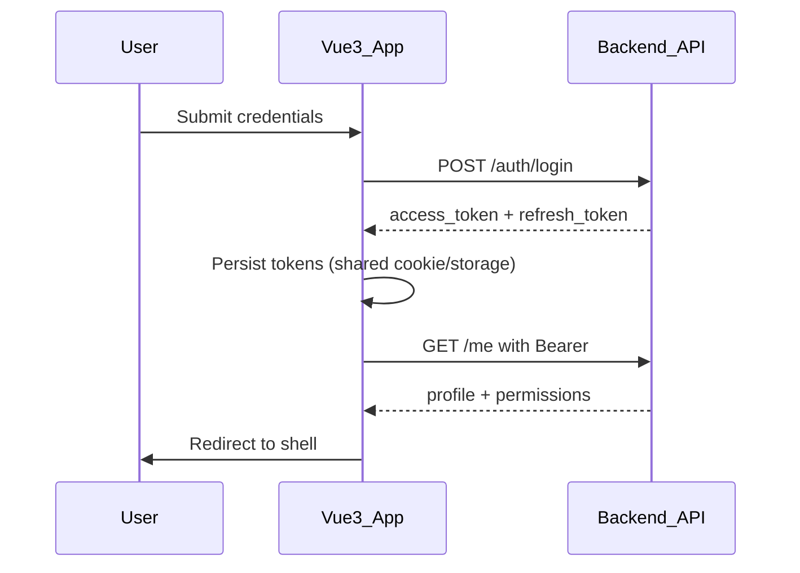
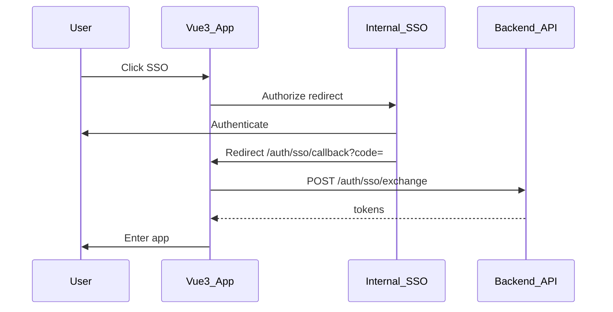

# Auth: JWT + Internal SSO — Sequence & Parity Spec

> Goal: Vue 3 auth behaves identically for users so **rollback does not force mass re-login**.

## Components

| Piece | Vue 2 (legacy) | Vue 3 (target) |
|-------|----------------|----------------|
| Login form | Local JWT password grant | Same API contract |
| SSO | Internal IdP redirect | Same client_id / redirect URIs (+ v3 callback if needed) |
| Token storage | Prefer **same cookie name/domain/path** as Vue 2 | Mirror exactly |
| API auth | `Authorization: Bearer <access>` | Same axios interceptor |
| Refresh | Refresh token rotation endpoint | Same |
| Logout | Revoke + clear storage + IdP logout optional | Same |

## Sequence — Password JWT

## Sequence — SSO

## Token contract (must match Vue 2)

Document actual values from legacy during Audit:

| Key | Expected | Actual (fill) |
|-----|----------|---------------|
| Access cookie name | e.g. `access_token` | |
| Refresh cookie name | e.g. `refresh_token` | |
| Cookie Domain | e.g. `.company.local` | |
| Cookie Path | `/` | |
| Cookie Secure / SameSite | Secure; Lax or None | |
| LocalStorage keys (if any) | | |
| JWT claims used | `sub`, `roles`, `exp` | |
| Clock skew tolerance | 30–60s | |

## Router guards (Vue 3)

1. `requiresAuth` — no valid access → login (preserve `redirect` query).
2. `requiresPermission` — use `usePermission`.
3. SSO callback route **public**.
4. After login, honor `redirect` only if same-origin relative path.

## Rollback implications

- Shared cookie domain ⇒ switching proxy Vue3 ↔ Vue2 keeps session.
- If Vue 3 must use a new SSO redirect URI, register it **before** W1 cutover; keep Vue 2 URI active.
- Never encrypt tokens with app-specific keys that differ between apps.

## Test cases (Auth parity)

- [ ] Login password success/fail
- [ ] SSO success / deny / cancel
- [ ] Token refresh mid-session
- [ ] Expire access → silent refresh → retry API
- [ ] Logout clears both apps’ readable storage
- [ ] Deep-link `/perf/live` while logged out → login → return
- [ ] Rollback during session: user still authenticated on Vue 2
