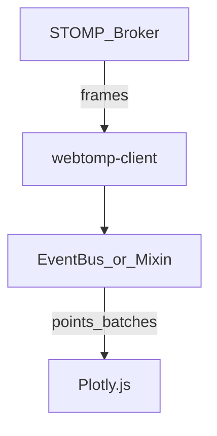
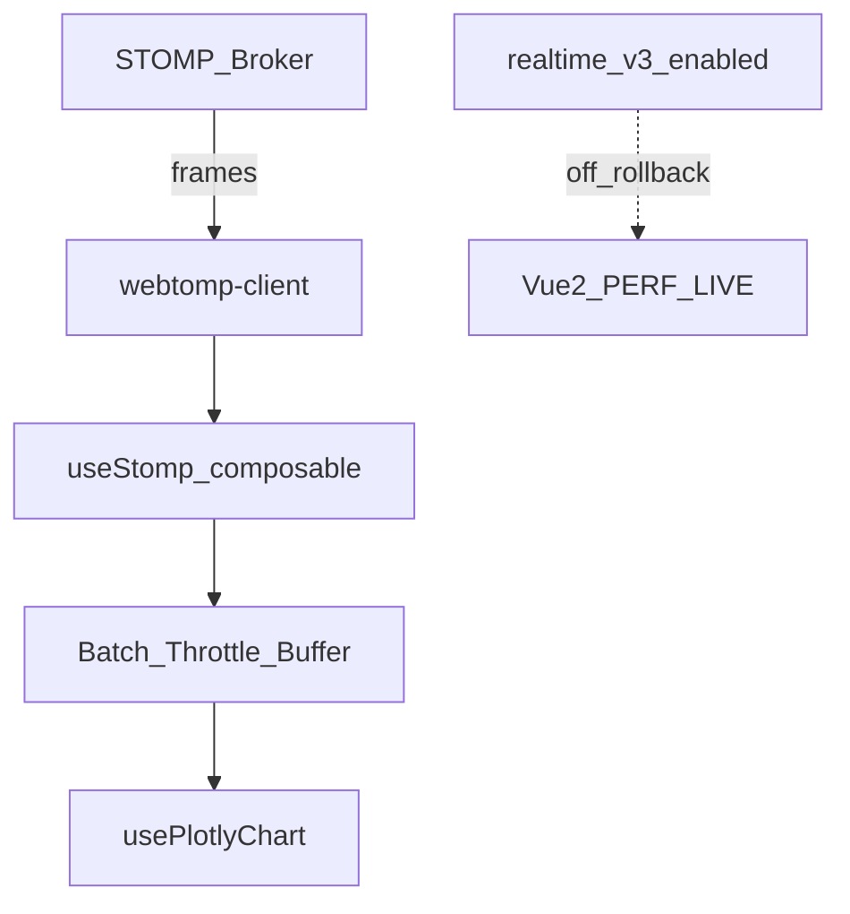

# Performance Testing Deep-Dive (Core / W4)

> Highest technical risk. Spike `useStomp` + Plotly strategy **early (parallel to W2)** after W1 shell is up.

## Current architecture (Vue 2)

## Target architecture (Vue 3)

## Contract to preserve (do not change BE unless required)

| Item | Spec (fill in Audit) | Notes |
|------|----------------------|-------|
| Broker URL | `wss://…` | From env |
| STOMP host/vhost | | |
| Auth header / login | JWT? | Same as Vue 2 |
| Subscribe destinations | e.g. `/topic/perf.{runId}` | |
| Message payload schema | JSON points | Version field? |
| Heartbeat | outgoing/incoming ms | |
| Reconnect policy | exponential backoff | Mirror legacy |
| Avg message rate | msg/s | Benchmark target |
| Peak message rate | msg/s | |
| Points per message | | |

## Plotly update strategy (decision)

Evaluate on staging with production-like stream:

| Strategy | Pros | Cons | Verdict gate |
|----------|------|------|--------------|
| `Plotly.newPlot` each time | Simple | Too slow | Reject if >5Hz |
| `Plotly.react` | Full layout sync | Medium cost | OK mid frequency |
| `Plotly.restyle` / `extendTraces` | Fast append | Harder multi-trace | **Preferred for live** |

**Decision rule:** Choose the cheapest API that keeps UI ≤ 100ms frame budget at peak rate. Document chosen API in spike report.

## Backpressure

1. Batch window 50–100ms OR max N points.
2. Drop/coalesce intermediate points if buffer > high-water (document UX).
3. Pause subscription when tab `document.hidden` (optional; confirm product).
4. Cap visible points (sliding window) to control memory.

## Soak test requirements

| Metric | SLO (proposed) |
|--------|----------------|
| Tab open duration | 2–4 hours |
| Memory growth | < 20% after first 15 min steady state |
| WS disconnect recovery | < 5s reconnect success ≥ 99% |
| Chart freeze (>1s no paint under load) | 0 in soak |
| CPU (main thread avg) | Document baseline vs Vue 2 |

## Feature flag

- Name: `realtime_v3_enabled`
- Default off until W4 soak green
- Proxy can also route `/perf/live` → Vue 2 independently

## Spike checklist (Senior, ~3–5 days, after W1)

- [ ] Connect webtomp-client from Vite app
- [ ] Auth to broker parity
- [ ] Subscribe + parse payload
- [ ] Benchmark Plotly strategies
- [ ] Memory profile
- [ ] Write `useStomp` + `usePlotlyChart`
- [ ] Spike report signed → start W4 implementation
